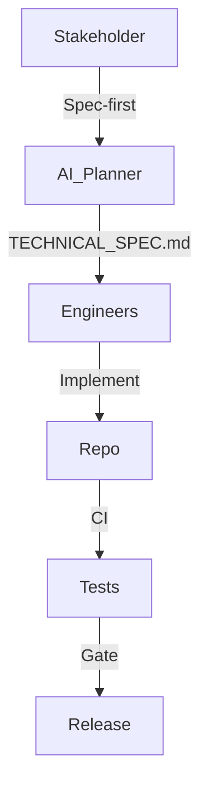

# Technical Spec

## Architecture Overview

## Data Model / Interfaces
- Enumerate services, APIs, schemas.
- Document contracts that AI assistants must respect.

## Key Algorithms / Flows
- Sequence diagrams or step-by-step breakdowns.
- Note reasoning constraints for AI agents.

## Non-Functionals
- Performance budgets, security requirements, observability checkpoints.

## Test Plan
- Unit, integration, and e2e coverage expectations.
- Edge cases and regression watch list.

## Rollout & Migration
- Launch criteria, kill switch, rollback strategy.
